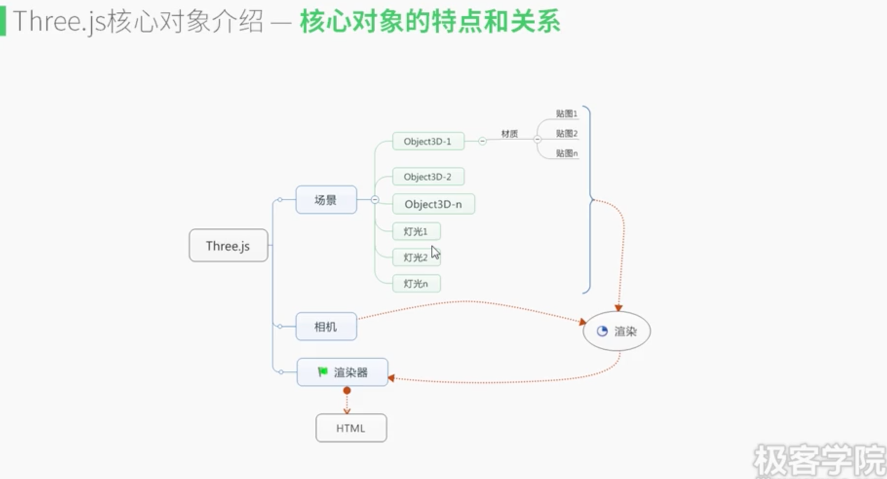

# Three.js 笔记 -- 核心对象

----

## threejs核心对象
 - 场景、object3D
 - 相机、渲染器
 - 材质、贴图、灯光

 构建三维场景的基础元素，也是构建复杂场景的基础

  

----
### 场景
### object3D

- 网格对象 (几何对象, 材质对象)

  var geometry = new THREE.BoxGeometry( 1, 1, 1 ); // 几何对象

  var material = new THREE.MeshBasicMaterial( { color: 0x00ff00 } ); // 材质

  var cube = new THREE.Mesh( geometry, material ); // 网格对象

### 材质
MeshBasicMaterial 没有光照信息
MeshLambertMaterial 有明暗
MeshPhongMaterial 具有高光
